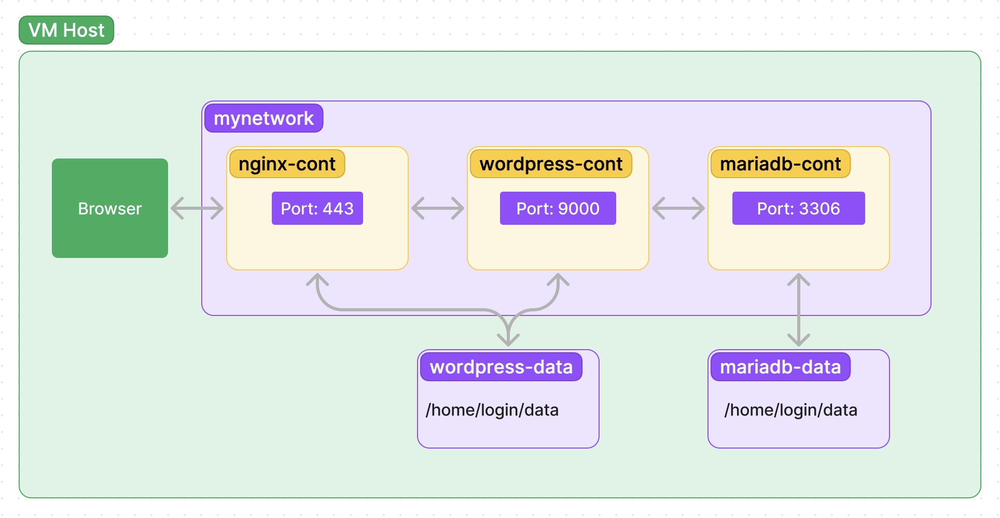

# Inception - A Docker Infrastructure in a Virtual Machine

*This project was developed as part of the Ecole 42 curriculum*

## Overview

`Inception` is a project from Ecole 42 that involves the creation of a service network running in designated Docker containers. All of this is running inside a virtual machine.

## Description

The `Inception` project is an exercise of configuring services.

| Service   | Description                                                                         |
|-----------|-------------------------------------------------------------------------------------|
| Nginx     | Web server responsible for serving web content and handling HTTPS connections.      |
| WordPress | Content Management System used to create and manage website content.                |
| MariaDB   | Relational Database Management System serving as the backend database for WordPress.|

## Roadmap

If you are just getting started on the project, I would suggest you to take these steps!

1. Set up your Virtual Machine
	- If you are a 42 student, chances are you already have VirtualBox on school Macs.
	- If your computer is running Apple silicon, UTM is a good alternative! (Docker compose might take a while though...)
	- I chose Alpine with Xfce as the host OS.
	- Install Docker and Docker Compose.

2. Familiarize yourself with Docker
	- YouTube is full of great tutorials!
	- Don't stress about the details to much, just get the main concepts down.
	- Choose the distro to build your images from.
		- I would strongly suggest Alpine; it is lighter and faster to build.
		- However, Debian documentation is more comprehensive so any issues you might come across will be a bit easier to fix here.

3. Start up with Nginx
	- No need to have a docker compose / Makefile yet. Instead, familiarize yourself with basic Docker commands.
		| Command                             | Description                                           |
		|-------------------------------------|-------------------------------------------------------|
		| `docker ps -a`                      | Show all containers (running and stopped)              |
		| `docker rm <ID>`                    | Remove a specific container by its ID                  |
		| `docker images`                     | List all available images                              |
		| `docker rmi <ID>`                   | Remove a specific image by its ID                      |
		| `docker build -t <my-nginx> .`      | Build a Docker image named '<my-nginx>' from the current directory |
		| `docker run -d -p 80:80 --name <my-nginx-container> <my-nginx>` | Run a container named '<my-nginx-container>' based on the '<my-nginx>' image, mapping port 80 from the host to port 80 in the container |
		| `docker exec -it <container_name_or_id> <command>` | Execute a command inside a running container interactively |
		| `docker logs <container_name_or_id>` | View logs from a specific container                    |
	- Try to configure Nginx to serve you a test html. (You can find an example at /srcs/requirements/nginx/tools)
		- First at http://localhost:80
		- Then add SSL, and do the same thing for https://localhost:443

4. Follow up with MariaDB
	- You can set up docker compose and Makefile now!
		- Dont stress about the network for now.
		- These compose commands will be helpful in your Makefile:
			| Command                                                       | Description                                                                            |
			|---------------------------------------------------------------|----------------------------------------------------------------------------------------|
			| `docker-compose -f srcs/docker-compose.yml build`             | Build containers defined in the 'docker-compose.yml' file located at 'srcs/' directory |
			| `docker-compose -f srcs/docker-compose.yml up -d`             | Start containers in detached mode                                                      |
			| `docker-compose -f srcs/docker-compose.yml down --rmi all -v` | Stop and remove containers, networks, volumes, and associated images                   |
			| `docker system prune -f`                                      | Remove all unused containers, networks, images, and volumes                            |
	- Create your `.env` file.
	- Learn to use `docker exec -it <container_name_or_id> <command>` to confirm that you have created a new database in MariaDB.
	- Make sure that your containers run error free by running `docker logs <container_name_or_id>`

5. Wrapping things up with WordPress
	- You should now perfect your `docker-compose.yml` by adding the network in.
	- Make sure that the container network is configured correctly.
	- Configure Nginx to pass the PHP requests to your WordPress container via FastCGI.
	- You can access the Wordpress admin login on `login.42.fr/wp-admin`
