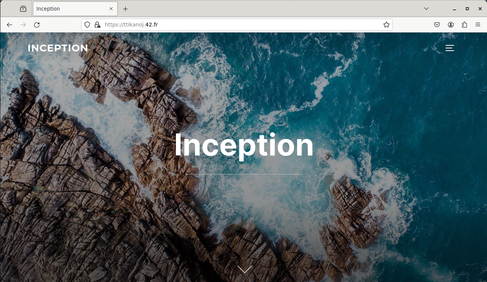

# Inception - A Docker Infrastructure in a Virtual Machine

*This project was developed as part of the Ecole 42 curriculum*

## Overview

`Inception` is a project from Ecole 42 that involves the creation of a service network running in designated Docker containers. All of this is running inside a virtual machine.

## Description

The `Inception` project is an exercise of configuring services.

+------------+-------------------------------------------+
| Service    | Description                               |
+------------+-------------------------------------------+
| Nginx      | Web server responsible for serving web    |
|            | content and handling HTTPS connections.   |
+------------+-------------------------------------------+
| WordPress  | Content Management System (CMS) used to   |
|            | create and manage website content.        |
+------------+-------------------------------------------+
| MariaDB    | Relational Database Management System     |
|            | (RDBMS) serving as the backend database   |
|            | for WordPress.                            |
+------------+-------------------------------------------+

## Roadmap
